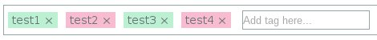

# Angular TagEditor

[![GitHub version][versionImage]][repository]
[![Build Status][buildBadge]][travis]
[![DevDependency Status][devDependencyBadge]][devDependencyStatus]

[versionImage]: https://badge.fury.io/gh/Forumouth%2Fangular-tageditor.svg
[repository]: https://badge.fury.io/gh/Forumouth%2Fangular-tageditor
[buildBadge]: https://travis-ci.org/Forumouth/angular-tageditor.svg?branch=master
[travis]: https://travis-ci.org/Forumouth/angular-tageditor
[devDependencyBadge]: https://david-dm.org/Forumouth/angular-tageditor/dev-status.svg
[devDependencyStatus]: https://david-dm.org/Forumouth/angular-tageditor

## What's this?



It is tageditor for AngularJS

## Why did you invent it?

I want a tageditor for AngularJS, and I found a lot of tageditors,
but they are for ReactJS. Then I found some tageditors for AngularJS,
but they are not well-tested and/or has invalid tags (moreover they are unable
to use script-side styling). These reasons are enough to re-develop tageditors.

## How to install angular-tageditor

Currently WIP

## How to use it?

This repository generates 2 files; `dist/assets.css` for styling, and
`dist/angular-tageditor.js` for scripting. And of course, you will require
to have [jQuery](https://jquery.com/) and
[AngularJS](https://angularjs.org/) installed.

Here is the example:

`index.html`
```html
<!DOCTYPE html>
<html lang="en">
<head>
  <meta charset="UTF-8">
  <title>Angular Tageditor Example</title>
  <script src="bower_components/jquery/dist/jquery.js"></script>
  <script src="bower_components/angular/angular.js"></script>
  <script src="bower_components/angular-mocks/angular-mocks.js"></script>
  <script src="dist/angular-tageditor.js"></script>
  <link rel="stylesheet" href="dist/assets.css">
  <script>
    (function () {
      angular.module("test", [
        "ngTagEditor"
      ]).controller("mainController", [
        "$scope",
        function (scope) {
          scope.tags = ["test1", "test2", "test3"];
        }
      ]);
    }).call(this);
  </script>
</head>
<body data-ng-app="test"
  data-ng-controller="mainController">
  <h1>AngularJS Tag Editor Example</h1>
  <textarea class="ng-tag-editor"
    data-ng-model="tags">
  </textarea>
</body>
</html>
```

## Options

Here are the options that can be specified as attirbutes:

* `data-ng-model` (Required): Specify the model to edit. (
  I don't think this option needs description.)
* `data-tag-change` (Optional): When the model specified by `data-ng-model` is
  changed (i.e. a tag is added/removed), this option is evaluated.
  In addition you can use `index` for where is changed and `value` for
  the text of tag
* `data-tag-add` (Optional): When a tag is added to the model specified by
  `data-tag-model`, this option is evaluated.
  In addition you can use `index` for where is changed and `value` for
  the text of tag
* `data-tag-del` (Optional): When a tag is deleted to the model specified by
  `data-ng-model`, this option is evaluated.
  In addition you can use `index` for where is changed and `value` for
  the text of tag
* `data-tag-style` (Optional): This is evaluated when individual tags are
  initialized and the returned value from this function is set to
  `data-ng-style` for the individual tags.
  In addition you can use `index` for where is changed and `value` for
  the text of tag
* `data-text-max-length` (Optional): `data-ng-maxlength` for editor
  (see styling paragraph) If not specified, no limit.
* `data-tag-max-length` (Optional): maximum number of the tag.
  If not specified, no limit.
* `data-placeholder` (Optional): `placeholder` for the editor.

### Note: the order of `tag-add` / `tag-del` and `tag-change`

`tag-change` is called **before** `tag-add` / `tag-del`. This might be a
problem when you edit styles from script.

## Styling

### Writing in css (or alt-stylesheet)

As you can see [style script](./src/main.less), this tageditor has just 3
simple elements; `<ul>` with `ng-tag-editor` class, `<li>` tag, and `input`
tag with `editor` class. The `<li>` tag and `<input>` tag are placed as
children of the `<ul>` tag (i.e. `ul.ng-tag-editor` in QuerySelector Style).

Here are the purposes of the tag:

* `ul.ng-tag-editor`: This is used for defining outline of the editor
* `li` or `li.tag`: This is used for showing already edited tags.
  Therefore this query selector must not be editable for now.
* `li.editor`: This is used for wrapping `input.editor` as a child of
  `ul.tag-editor`.
* `input.editor`: This is used for adding a tag. And as we can see its name,
  it works as an editor. And of course, this must be editable.
* `input.editor.maxTagNumExceeded`: When the user tries to add a tag over the
  number of tags that is specified by `data-text-max-length`,
   `maxTagNumExceeded` is added to `input.editor`.

When you want to create a stylesheet for this tageditor, above query string
might be useful. For example, if you want to change a background color when
`maxTagNumExceeded` is added, you can just make a style like this:

`example.css`
```css
ul.ng-tag-editor input.editor.maxTagNumExceeded {
  background-color: white;
}
```

### Write by script

Not only writing with css you can write styles from script by returning the
proper value on `tag-add` or `tag-change`. For example, like this:

`example.coffee`
```coffee
angular.module("test", [
  "ngTagEditor"
]).controller("main", [
  "$scope"
  (scope) ->
    scope.tags = ["test1", "test2", "test3"]
    scope.changed = (index) ->
      if index % 2 is 1
        return ("background-color": "#F8BBD0")
])
```

Note that this works when a tag is added only for now.

### Contributing
Pull request would be welcome :simple_smile:
